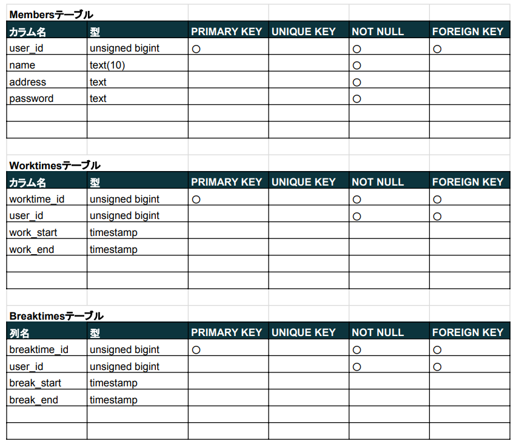
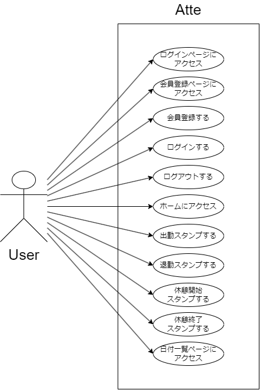
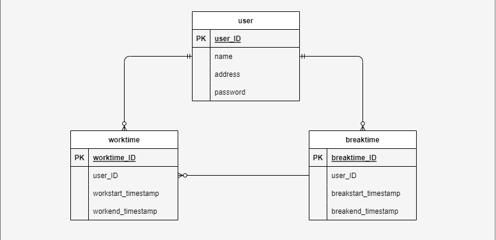

# Atte

## 作成目的
人事評価に使用するため
## アプリケーションURL
初期画面
http://localhost/
## その他リポジトリ

## 機能一覧
会員登録

ログイン

ログアウト

出勤タイムスタンプ

退勤タイムスタンプ

休憩開始タイムスタンプ

休憩開始タイムスタンプ

日付一覧表示
## 使用技術
MySQL_8.0.26

Laravel_8.83.27

nginx_1.21.1

PHP_7.4.9

GitHub_2.34.1
## テーブル設計

## ER図

## 環境構築

## その他
申し訳ありません。
基本機能の完成にまで至りませんでした。